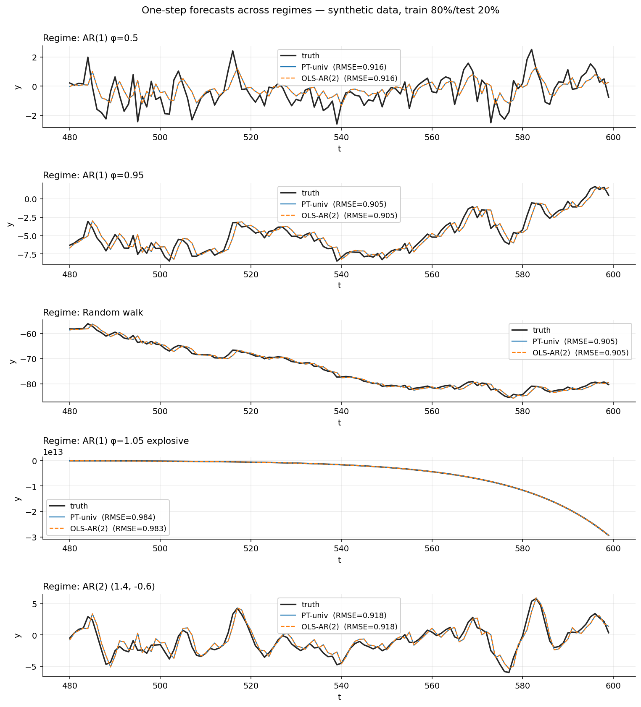
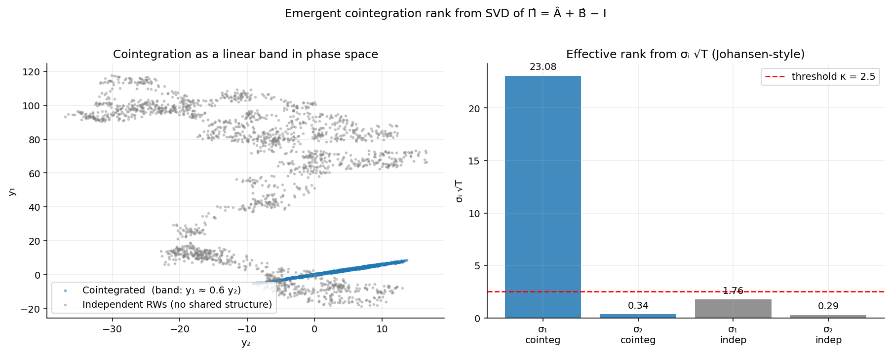
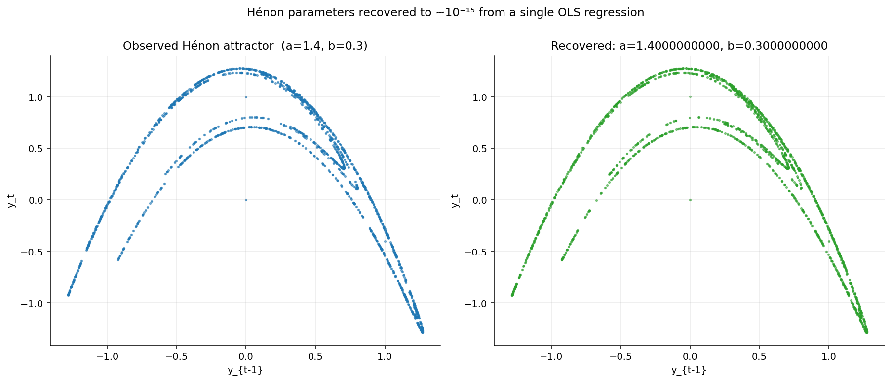
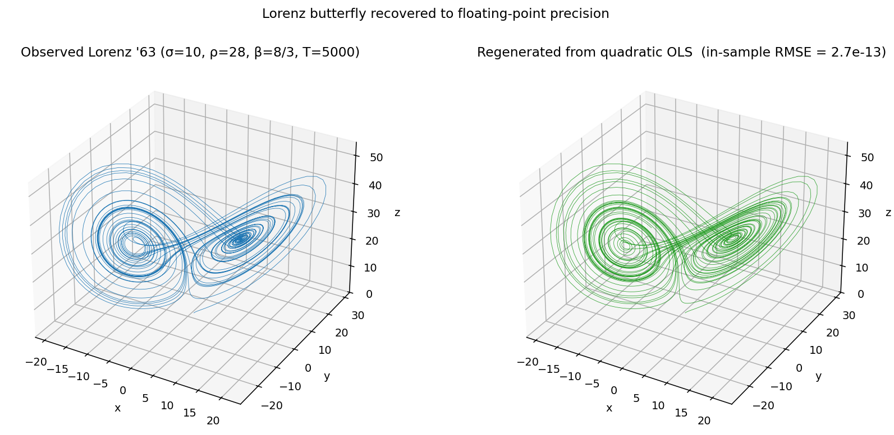

# On The Algebraic Restoration of the Pure-Time Argument of Probability
## Geometric Signal Dynamics (GSD) Research Programme

> Companion code to the paper
> **On the Algebraic Restoration of the Pure-Time Argument of Probability**
> Juan Ignacio Vázquez Broquá (Pontificia Universidad Católica Argentina, 2026)

This repository ships the reference implementation, an executable
notebook with visualisations, smoke-test scripts that reproduce the
empirical tables, and the manuscript.

---

## The story in three paragraphs

Time-series practitioners face a regime problem. Stationary processes
get OLS; integrated I(1) processes get ADF and Phillips–Perron;
explosive AR processes get Park-style estimators; cointegrated panels
get the two-step Engle–Granger or the multi-step Johansen procedure;
each regime has its own estimator and its own diagnostic, and the
practitioner must dispatch between them on prior assumption about
the regime they are in. The dispatch is itself a source of error.

Hamilton, in 1834, articulated a different coordinate system for
time-series — *pure time* — in which the natural object is the
ordered triplet of moment, velocity, and acceleration. This
repository ships a single OLS regression in that coordinate system.
The regression is algebraically equivalent to the classical VAR(2)
in the regimes where the latter applies, *but its parameters carry
the cointegration structure directly*: the rank of the matrix
$\hat\Pi = \hat A + \hat B - I$, read off from a single SVD,
recovers the cointegration rank that Johansen's procedure ordinarily
asks the user to specify in advance. No regime-specific dispatch.
No prior specification of $r$.

The paper is a **proof of existence**, in the strict sense — a
demonstration that a method of this kind exists, that it is truthful,
and that it bears fruits. It is the practical-mode entry-point of an
integrated programme whose theoretical foundations are developed in
two companion papers (non-abelian characteristic functions on
$\mathrm{Spin}(3)$ and geometric invariants of the embedded
trajectory) and whose philological framing is given in the synthesis
manuscript of the GSD programme. The construction here is not
claimed to be optimal — only that it works, on every regime tested.

---

## What you will see

The notebook `notebooks/pure_time_estimator.ipynb` walks through the
four central claims of the paper, with both tables and visualisations.

**1. Universal regime coverage** — the same OLS regression handles
stationary, near-unit-root, random walk, explosive AR, and AR(2)
without modification. PT-univ and OLS-AR(2) overlap in the well-
conditioned regimes; the explosive panel is where they diverge.



**2. Emergent cointegration rank** — the SVD of $\hat\Pi = \hat A
+ \hat B - I$ recovers the cointegration rank as a by-product of
unconstrained OLS. The diagnostic separates cointegrated I(1) pairs
($r = 1$) from independent random walks ($r = 0$) by a clean
factor-of-70 gap in the spectrum, with no prior specification of
$r$ in the spirit of Johansen.



**3. Univariate chaos: Hénon to machine precision** — the quadratic
extension on the pure-time basis recovers Hénon parameters $(a, b)$
to floating-point precision on noise-free data. The two attractors
are visually identical because the recovery error is $\sim 10^{-15}$.



**4. Multivariate chaos: Lorenz '63 to machine precision** — the
same quadratic basis applied to the 3-D Lorenz system fits the
dynamics with in-sample RMSE $\sim 10^{-13}$. The butterfly
attractor is reconstructed exactly from a single OLS regression on
the 13 features of the multivariate quadratic basis.



---

## Quick start

```bash
git clone https://github.com/juanivb/gsd_algebraic_restoration_of_pure_time_argument_of_probability.git
cd gsd_algebraic_restoration_of_pure_time_argument_of_probability
pip install -e .
```

The library has only `numpy` as a hard dependency. The notebook and
examples additionally require `matplotlib`, `pandas`, `nbformat`:

```bash
pip install -r requirements.txt
```

A minimal working example:

```python
import numpy as np
from gsd_puretime import (
    ptls_universal, ab_to_phi,
    ptmv, ec_matrix, emergent_rank,
)

# ---- Univariate: forward equation y_{t+1} = a y_t + b Δy_t + ε ----
y = np.cumsum(np.random.standard_normal(1000))   # I(1) random walk
a, b = ptls_universal(y)
phi1, phi2 = ab_to_phi(a, b)
print(f"AR(2) representation: φ_1 = {phi1:.4f}, φ_2 = {phi2:.4f}")

# ---- Multivariate: cointegration rank emerges from SVD of Π̂ ----
T = 1500
y2 = np.cumsum(0.5 * np.random.standard_normal(T))
y1 = 0.6 * y2 + 0.5 * np.random.standard_normal(T)   # cointegrated
Y = np.column_stack([y1, y2])
A, B = ptmv(Y)
M = ec_matrix(A, B)
r, sigmas = emergent_rank(M, T=T, threshold=2.0)
print(f"Emergent cointegration rank: r̂ = {r}  (truth: 1)")
```

## Reproducing the empirical tables of the paper

```bash
# Battery D — deterministic exactness
python examples/01_battery_d_deterministic.py

# Universal regime sweep
python examples/02_universal_regime_sweep.py

# Cointegration rank emergence
python examples/03_emergent_cointegration.py

# Multivariate chaos (Lorenz, coupled logistic)
python examples/04_lorenz_chaos.py
```

The Jupyter notebook reproduces all four headline visualisations
above in ~2 minutes of runtime on a laptop.

## Repository contents

```
gsd_puretime/    reference Python library  (numpy-only, ~500 lines)
tests/           pytest suite              (~10 tests)
notebooks/       pedagogical Jupyter notebook
examples/        smoke-test scripts that reproduce the paper tables
paper/           paper.tex + paper.pdf     (the manuscript)
figures/         the four canonical figures shown above
```

## Tests

```bash
pytest tests/
```

The suite covers Battery-D exactness on sine, logistic, Hénon; the
algebraic equivalence with OLS-AR(2) in stationary regimes; the
cointegration rank emergence on simulated cointegrated panels;
Hénon parameter recovery to machine precision via the quadratic.

## Citation

```
@article{vazquezbroqua2026puretime,
  title  = {On the Algebraic Restoration of the Pure-Time Argument of Probability},
  author = {V\'azquez Broqu\'a, Juan Ignacio},
  year   = {2026},
  note   = {Submitted, Mathematical Proceedings of the Royal Irish Academy.
            Companion to two foundational manuscripts on non-abelian
            characteristic functions and geometric invariants of the
            kinematic embedding.}
}
```

---

## Institutional acknowledgements

This work would not have been possible without the sustained
intellectual and material support of two institutions, to whom the
author is indebted:

**Departamento de Economía, Pontificia Universidad Católica
Argentina [(UCA)](https://uca.edu.ar/es/facultad-de-teresa-de-avila/departamento-de-ciencias-economicas).** The programme of which this repository is one
piece took shape over several years of teaching, supervision, and
quiet encouragement at the Department of Economics of the UCA. The
academic environment that allowed the work to mature into a coherent
research arc is owed entirely to the Department's commitment to
deep, slow scholarship in an era that does not always reward it.

**Research Lab — Chapter Data, [MODO](https://ar.linkedin.com/company/modo-arg).** The empirical and
computational backbone of the project — from infrastructure to
reproducibility discipline to the operational test of every claim
on real-world data — was developed inside the Chapter Data Research
Lab at MODO. The Lab provided the daily setting in which abstract
ideas were forced to confront practical constraints, and the
collegial environment in which they could be discussed honestly.
Without that setting, none of the empirical claims in this paper
would carry weight.

The author acknowledges with gratitude the freedom to combine
academic reflection with industry engagement that both institutions
made possible.

---

## Licence

MIT (see `LICENSE`).
